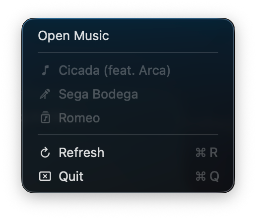

# Music Presence

Show your now-playing track from Apple Music on Discord.

unlike other solutions:

- Music Presence updates your status near-instantly when you change tracks.
- timestamps are as accurate as reasonably possible.
- doesn't eat your memory for lunch. (it's a real native app)

the app lives in Menu Bar. cmd-drag it out of the menu bar to hide the icon.
re-launch the app while it's running in the background to restore the icon at any time.

to automatically start the app when you log in to your Mac, open System Settings → General → Login Items & Extensions.
click <kbd>+</kbd> under "**Open at Login**" then choose Music Presence.
